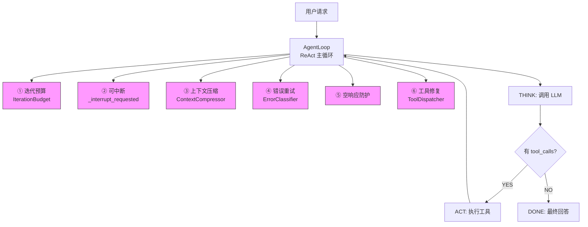
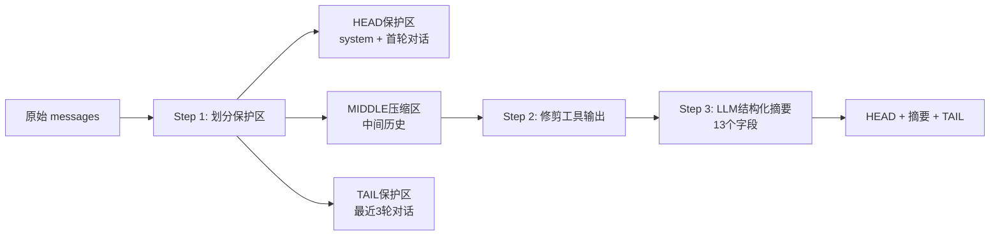
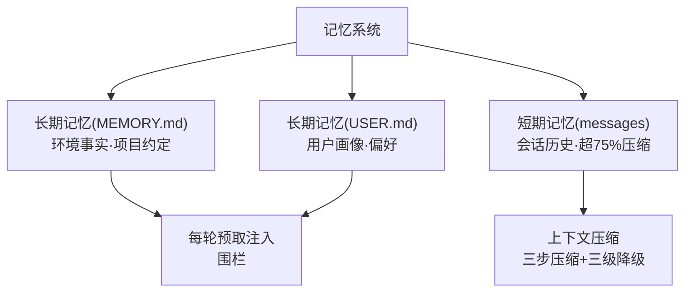
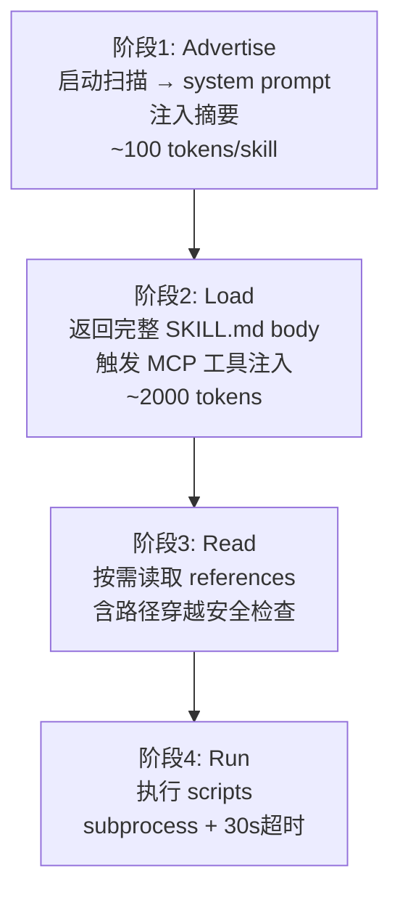

# 从0到1搭建 Agent：核心代码梳理

> 本文从 [[从0到1搭建 Agent ：Agent 原理分析及个人助手实践（长文干货）]] 的实践篇中提取核心代码逻辑，按模块梳理架构与关键实现。深层设计哲学与跨模块联系详见 [[从0到1搭建Agent-深层思想脉络与设计哲学]]

## 架构总览

整个 Agent 采用 ==**ReAct 主循环 + 六重保障**== 的架构设计：



核心原则：==能力层尽可能抽象，对编排层暴露最少接口，保持 Loop 流程简洁==。

|模块|核心文件|关键设计|
|---|---|---|
|**AgentLoop**|`loop.py`|ReAct 循环 + 六重保障（预算/中断/压缩/重试/空响应/修复）|
|**上下文压缩**|`context_compressor.py`|三步压缩（保护区划分→工具输出修剪→LLM结构化摘要）+ 三级降级 + 防抖机制|
|**错误分类与重试**|`error_classifier.py`|15+种错误分类 → 三层匹配（状态码/消息模式/异常类型）→ 分类后恢复|
|**记忆系统**|`memory_manager.py`|三层记忆（MEMORY.md/USER.md/messages）+ 围栏注入 + 流式清洗器|
|**工具系统**|`tool_dispatcher.py`|Registry注册→Dispatch分发→JSON修复→工具名模糊匹配→MCP嵌套参数包装|
|**SubAgent**|`delegate.py`|委托工具 schema→子agent独立实例→四维资源控制→权限隔离|
|**Plan(todo)**|`todo_tool.py`|==Plan即工具==（不是模式切换），merge/replace双模式，压缩后状态注入|
|**Skill系统**|`skills_loader.py`|四阶段渐进式加载（Advertise→Load→Read→Run），条件注册，路径穿越安全检查|
---

## 模块一：AgentLoop 核心循环

> 对应文件：`agent/loop.py`

```python
class AgentLoop:
    def run(self, messages, tools) -> Generator:
        budget = IterationBudget(self._max_iterations)  # 保障①: 迭代预算

        while budget.consume():
            # 保障②: 可中断
            if self._interrupt_requested:
                yield {"type": "interrupted"}
                return

            # 保障③: 上下文压缩
            messages = self._check_and_compress(messages)

            # 记忆预取注入
            prefetch_context = self._memory.prefetch_all(user_query)

            # THINK: 调用 LLM（保障④: 错误分类+重试）
            response = yield from self._api_call_with_retry(messages, tools)

            # 保障⑤: 空响应防护
            if not content and not tool_calls:
                consecutive_empty += 1
                if consecutive_empty >= 2:
                    yield {"type": "error", "message": "LLM 连续返回空响应"}
                    return
                continue

            # ACT: 执行工具调用（保障⑥: 名称/参数修复）
            if tool_calls:
                yield from self._dispatcher.execute_tool_calls(tool_calls, messages)
                continue

            # DONE: 无工具调用 → 最终回答
            yield {"type": "final_answer", "content": content}
            return

        # 预算耗尽 → 自动生成工作摘要
        yield {"type": "budget_exhausted", "summary": self._build_summary(messages)}
```

> [!important] 六重保障速查
> | # | 保障 | 模块 | 触发条件 | 行为 |
> |---|------|------|----------|------|
> | ① | 迭代预算 | `IterationBudget` | 达上限(90轮) | 生成摘要→优雅退出 |
> | ② | 可中断 | `_interrupt_requested` | 外部标志 | 保存记忆→立即退出 |
> | ③ | 上下文压缩 | `ContextCompressor` | token≥75%窗口 | 三步压缩+三级降级 |
> | ④ | 错误重试 | `ErrorClassifier` | API异常 | 分类→重试/压缩/终止 |
> | ⑤ | 空响应防护 | 连续计数器 | 连续2次空 | 注入提示→超限终止 |
> | ⑥ | 工具修复 | `ToolDispatcher` | 名称/参数错误 | 模糊匹配修复→重调用 |

---

## 模块二：上下文压缩（最复杂的子系统）

> 对应文件：`agent/context_compressor.py`

### 核心流程：三步压缩策略



### Step 2: 工具输出智能摘要

```python
def _summarize_tool_result(tool_name, tool_args, tool_content) -> str:
    """不同工具关注不同信息——让 LLM 在摘要中回忆"之前做了什么""""
    # terminal: 提取命令和退出码
    if tool_name == "terminal":
        cmd = args.get("command", "")
        exit_code = extract_exit_code(content)
        return f"[terminal] ran `{cmd}` -> exit {exit_code}, {line_count} lines output"

    # read_file: 提取路径和偏移量
    if tool_name == "read_file":
        return f"[read_file] read {path} from line {offset} ({content_len} chars)"

    # write_file: 提取路径和写入行数
    if tool_name == "write_file":
        return f"[write_file] wrote to {path} ({written_lines} lines)"

    # search_files: 提取模式和匹配数
    if tool_name == "search_files":
        return f"[search_files] {target} search for '{pattern}' -> {count} matches"

    # 其他: 通用截断（短输出直接保留，长输出截断+标注原始长度）
    if len(content) <= 200:
        return content
    return f"[{tool_name}] {preview}...（已截断，原始长度 {len(content)} 字符）"
```

### Step 3: LLM 驱动的结构化摘要

```python
def _generate_llm_summary(self, pruned_middle, previous_summary, focus_topic) -> str:
    """双重保险: LLM 失败时回退到基于规则的简单摘要"""
    system_instruction = (
        "You are a summarization agent creating a context checkpoint. "
        "Write the summary in the same language the user was using. "
        "NEVER include API keys, tokens, passwords — replace with [REDACTED]."
    )

    # 摘要目标长度公式: min(max(最小值, 原始*压缩比), 天花板)
    summary_budget = max(
        MIN_SUMMARY_TOKENS,           # 最少 200 tokens
        min(
            int(content_tokens * SUMMARY_RATIO),  # 按比例压缩(0.3)
            SUMMARY_TOKENS_CEILING                 # 最多 2000 tokens
        ),
    )

    try:
        response = self.llm.chat(summarizer_messages, tools=None)
        return response.get("content", "").strip()
    except Exception:
        return self._build_structured_summary(...)  # 回退到规则摘要
```

### 三级降级（压缩失败兜底）

```python
def compress_with_fallback(self, messages, todo_store=None) -> list:
    # 第一次: 标准压缩
    result = self.compress(messages)
    if result_tokens < threshold: return result

    # 降级①(损失低): 尾部保护从6条→3条
    self.protect_last_n = 3
    result = self.compress(messages)
    if result_tokens < threshold: return result

    # 降级②(损失中): 删除最早10条工具结果
    filtered = [msg for msg in result if not should_remove(msg)]
    if result_tokens < threshold: return filtered

    # 降级③(损失高): 只保留 system + 最近3轮（紧急截断）
    return system_messages + [overflow_notice] + recent_messages
```

### 压缩防抖机制

```python
def compress(self, messages):
    # 检查最近5次压缩的平均节省率
    avg_saving = sum(self._recent_savings) / len(self._recent_savings)
    if avg_saving < COMPRESSION_DEBOUNCE_THRESHOLD:  # 默认10%
        return messages  # 已经压无可压，跳过压缩避免浪费LLM调用

    # ... 执行压缩 ...
    # 记录本次节省比例（用于后续防抖判断）
    saving_ratio = (before_tokens - after_tokens) / before_tokens
    self._recent_savings.append(saving_ratio)
```

### Todo 状态注入（防止压缩后"失忆"）

```python
def _inject_todo_state(self, messages, todo_store):
    """压缩完成后注入未完成的 todo 任务状态"""
    if todo_store is None: return messages
    injection_text = todo_store.format_for_injection()
    # 插入位置: 在尾部保护区之前
    messages.insert(insert_pos, {"role": "user", "content": injection_text})
```

---

## 模块三：错误分类与重试

> 对应文件：`agent/error_classifier.py` + `agent/loop.py`

### 错误分类器

```python
class FailoverReason(enum.Enum):
    """15+种错误原因，每种附带不同恢复策略"""
    auth = "auth"                      # 临时认证 → 换凭证
    auth_permanent = "auth_permanent"  # 永久认证 → 终止
    billing = "billing"                # 账单耗尽 → 终止
    rate_limit = "rate_limit"          # 限流 → 等待后重试
    overloaded = "overloaded"          # 过载 → 切换提供商
    server_error = "server_error"      # 服务器错误 → 重试
    timeout = "timeout"                # 超时 → 重试
    context_overflow = "context_overflow"  # 上下文溢出 → 压缩
    model_not_found = "model_not_found"   # 模型不存在 → 终止
    # ... 还有更多

    # 匹配三层策略:
    # Layer 1: HTTP状态码 → 429=限流, 402=账单, 401/403=认证
    # Layer 2: 错误消息模式 → "context length"=溢出, "rate limit"=限流
    # Layer 3: 异常类型名 → ReadTimeout/ConnectError=超时
```

### 分类后恢复策略

```python
def _api_call_with_retry(self, messages, tools, current_error_streak):
    try:
        response = self._llm.chat(messages=messages, tools=tools)
        return response
    except Exception as api_error:
        classified = classify_error(api_error, provider=self._llm.platform_name)

        if classified.should_compress:
            # 上下文溢出 → 压缩后重试
            compressed = self._compressor.compress_with_fallback(messages)
            messages.clear(); messages.extend(compressed)
            return None  # 让主循环重试

        if classified.retryable:
            # 瞬态/限流 → 指数退避+抖动重试
            delay = jittered_backoff(current_error_streak + 1)
            time.sleep(delay)
            return None

        # 永久错误 → 终止 + 报告用户
        yield {"type": "error", "message": f"LLM 调用失败: {classified.message}"}
```

---

## 模块四：记忆系统

> 对应文件：`agent/memory_manager.py`

### 三层记忆架构



### Memory 工具 Schema（LLM 主动写入）

```python
def create_memory_tool_schema() -> Dict:
    return {
        "type": "function",
        "function": {
            "name": "memory",
            "description": (
                "Save durable information to persistent memory. "
                "WHEN TO SAVE: User corrects you / shares preferences / "
                "you discover environment facts. "
                "TWO TARGETS: 'user'(who) / 'memory'(notes). "
                "ACTIONS: add, replace, remove."
            ),
            "parameters": {
                "properties": {
                    "action": {"enum": ["add", "replace", "remove"]},
                    "target": {"enum": ["memory", "user"]},
                    "content": {"type": "string"},
                    "old_text": {"type": "string"},
                },
                "required": ["action", "target"],
            },
        },
    }
```

### 记忆处理 Handler

```python
def handle_tool_call(self, tool_name, args) -> str:
    action, target, store = args.get("action"), args.get("target"), ...

    # 安全扫描: 写入前检测威胁模式
    if action in ("add", "replace"):
        threats = scan_context_threats(content)
        if threats:
            return json.dumps({"success": False, "error": f"Blocked: {threats}"})

    if action == "add":   result = store.add(content)
    elif action == "replace": result = store.replace(old_text, content)
    elif action == "remove":  result = store.remove(old_text)
```

### 记忆预取注入

```python
# 每轮对话前自动注入
# 1. 移除上一轮围栏（避免累积）
messages = [msg for msg in messages if not msg.get("_is_memory_fence")]

# 2. 提取最近 user query
user_query = extract_latest_user_message(messages)

# 3. 预取并注入
if user_query:
    prefetch_context = self._memory.prefetch_all(user_query)
    memory_block = build_memory_context_block(prefetch_context)
    messages.append({"role": "user", "content": memory_block, "_is_memory_fence": True})
```

### 围栏构建 & 流式清洗

```python
def build_memory_context_block(raw_context) -> str:
    """将记忆包装在 <memory-context> 围栏中"""
    clean = sanitize_context(raw_context)
    return (
        "<memory-context>\n"
        "[System note: recalled memory, NOT new user input.]\n"
        f"{clean}\n"
        "</memory-context>"
    )

class StreamingContextScrubber:
    """流式输出清洗器 — 处理跨 delta 边界的围栏标签过滤"""
    # 防止内部记忆通过流式输出泄漏给用户
    # 核心难点: 标签可能被拆分在两个 delta 中
    #   delta1: "...some text <memory"
    #   delta2: "-context>secret data</memory-context> visible text"

    def feed(self, text) -> str:
        # 用 _buf 缓冲区处理跨 delta 的部分标签
        # _in_span 标记是否在围栏内部
        while self._buf:
            if self._in_span:
                close_idx = self._buf.find(self._CLOSE_TAG)
                if close_idx == -1: break  # 关闭标签还没到
                self._buf = self._buf[close_idx + len(self._CLOSE_TAG):]
                self._in_span = False
            else:
                open_idx = self._buf.find(self._OPEN_TAG)
                if open_idx == -1:
                    # 安全输出（保留尾部防止截断标签）
                    safe_len = len(self._buf) - (len(self._OPEN_TAG) - 1)
                    output_parts.append(self._buf[:safe_len])
                    break
                output_parts.append(self._buf[:open_idx])
                self._in_span = True
        return "".join(output_parts)
```

---

## 模块五：工具系统

> 对应文件：`agent/tool_dispatcher.py` + `tools/mcp_service.py`

### 工具注册（Registry）

```python
def register(self, name, schema, handler, *, check_fn=None,
             is_async=False, toolset="", description="") -> None:
    """注册工具到注册表 — schema 控制与 LLM 交互，handler 控制执行"""
    with self._lock:
        self._tools[name] = ToolEntry(
            name=name, schema=schema, handler=handler,
            check_fn=check_fn, is_async=is_async,
            toolset=toolset, description=description,
        )
        self._generation += 1
```

### 工具分发（含修复逻辑）

```python
def _dispatch(self, tool_name, arguments) -> str:
    tool_entry = registry.get_tool(tool_name)
    if tool_entry is None:
        # 工具名修复: 模糊匹配
        repaired = self._repair_tool_name(tool_name)
        if repaired:
            tool_entry = registry.get_tool(repaired)
            tool_name = repaired

    if tool_entry is None:
        return f"工具 '{tool_name}' 未找到。可用工具: {available}"

    # 执行工具
    result = tool_entry.handler(**execution_args)
    return str(result) if result is not None else "工具执行完成（无输出）"
```

### 参数 JSON 修复（多策略）

```python
def repair_tool_arguments(raw_arguments) -> dict:
    # 策略1: 清理 surrogate 字符 → json.loads
    # 策略2: 补全缺失右括号 → json.loads
    # 策略3: 删除尾随逗号 → json.loads
    # 全部失败: 返回 {"raw_input": raw_arguments} 供 LLM 查看
```

### 工具名修复（多策略模糊匹配）

```python
def _repair_tool_name(self, tool_name) -> Optional[str]:
    # 策略1: 直接小写匹配
    # 策略2: 标准化（替换-和空格为_）
    # 策略3: 交叉组合变换（camelToSnake + stripSuffix + 两轮扩展）
    # 策略4兜底: difflib 模糊匹配（相似度≥70%）
```

### MCP 嵌套参数自动包装

```python
def _normalize_mcp_arguments(arguments, input_schema) -> dict:
    """LLM 常展平嵌套参数 {query:...} → 自动包装为 {request:{query:...}}"""
    properties = input_schema.get("properties", {})
    if len(properties) == 1:
        wrapper_key = next(iter(properties))
        if any(k in inner_props for k in arguments):
            return {wrapper_key: arguments}  # 自动包装
    return arguments
```

### MCP 工具按需注入（随 Skill 加载）

```python
def inject_skill_mcp_tools(self, skill_name, tools) -> None:
    """加载 skill 时，按需注入其声明的 MCP 工具"""
    mcp_tool_defs = self._skill_service.get_mcp_tool_definitions_for_skill(skill_name)
    existing_names = {t.get("function", {}).get("name", "") for t in tools}
    for tool_def in mcp_tool_defs:
        if tool_func_name not in existing_names:
            tools.append(tool_def)  # 去重后追加
```

---

## 模块六：SubAgent（子代理委托）

> 对应文件：`agent/delegate.py`

### 委托工具 Schema

```python
def create_delegate_tool_schema() -> Dict:
    return {
        "name": "delegate_task",
        "description": "将子任务委托给独立的子代理执行",
        "parameters": {
            "goal": {"description": "子任务目标"},
            "context": {"description": "上下文信息"},
            "role": {"enum": ["leaf", "orchestrator"],
                     "description": "leaf不能再委托, orchestrator可继续委托"},
        },
    }
```

### 子 Agent 创建与执行

```python
def _run_child_agent(self, goal, context, parent_llm, role, ...) -> DelegateResult:
    from agent.agent import IdleAgent

    # 构建工具集黑名单
    child_disabled_toolsets = list(DELEGATE_BLOCKED_TOOLSETS)
    blocked_tools = ["memory", "clarify"]  # 全局禁止
    if role == "leaf":
        blocked_tools.append("delegate_task")  # leaf 不能再委托

    # 构建子 agent 身份提示词
    child_identity = (
        f"你是一个子代理，负责完成以下特定任务。\n\n"
        f"{DELEGATE_EXECUTION_DISCIPLINE}\n\n"
        f"## 任务目标\n{goal}\n\n"
        f"## 上下文\n{context}\n\n"
        f"{DELEGATE_WORK_BOUNDARIES}\n\n"
        f"## 技术约束\n"
        f"- 角色: {role}\n"
        f"- 最大迭代次数: {max_iterations}\n"
        f"- 禁止使用的工具: {', '.join(blocked_tools)}\n"
    )

    # 创建子 Agent 实例（独立迭代预算 + 受限权限）
    child_agent = IdleAgent(
        llm=parent_llm,
        max_iterations=max_iterations,
        custom_identity=child_identity,
        enabled_toolsets=enabled_toolsets,
        disabled_toolsets=child_disabled_toolsets,
        enable_delegate=(role == "orchestrator" and current_depth < max_depth - 1),
    )

    result_data = child_agent.run_sync(goal)
    return DelegateResult(
        goal=goal, success=result_data.get("success", False),
        final_answer=result_data.get("final_answer", ""),
        tool_calls_count=metrics.get("tool_call_count", 0),
        iterations_used=metrics.get("total_iterations", 0),
        tokens_used=metrics.get("total_tokens", 0),
    )
```

### 资源控制四维度

| 维度 | 默认值 | 实现方式 |
|------|--------|----------|
| 并发控制 | 最多3个子agent | `ThreadPoolExecutor(max_workers=3)` |
| 迭代预算 | 子agent独立50次 | 独立 `IterationBudget` |
| 超时保护 | 600秒 | `future.result(timeout=600)` |
| 深度限制 | 最多1层委托 | `depth >= max_depth → role="leaf"` |

---

## 模块七：ReAct 模式下的 Plan 能力（todo 工具）

> 对应文件：`tools/todo_tool.py`

> [!tip] 核心设计思路
> **Plan 不是模式切换，而是 ReAct 循环中的一个普通工具 `todo`**。
> 简单任务零开销直接执行，复杂任务通过 `todo` 工具嵌入规划能力。

### Todo 工具 Schema

```python
TODO_SCHEMA = {
    "name": "todo",
    "description": (
        "Manage your task list. Use for complex tasks with 3+ steps. "
        "merge=false(default): replace all. merge=true: update by id. "
        "Only ONE item in_progress at a time. Mark completed immediately when done."
    ),
    "parameters": {
        "todos": {"items": {"id", "content", "status": "pending|in_progress|completed|cancelled"}},
        "merge": {"type": "boolean", "default": False},
    },
}
```

### TodoStore 核心实现

```python
class TodoStore:
    """会话级内存任务列表 — 每个 Agent 实例持有独立实例"""
    def __init__(self):
        self._items: List[Dict[str, str]] = []

    def write(self, todos, merge=False) -> List[Dict[str, str]]:
        if not merge:
            # 替换模式: 完全替换（创建新计划/推翻重来）
            self._items = [self._validate(t) for t in self._dedupe_by_id(todos)]
        else:
            # 合并模式: 按id增量更新 + 追加新项（完成一步后更新状态）
            existing = {item["id"]: item for item in self._items}
            for raw_todo in self._dedupe_by_id(todos):
                if item_id in existing:
                    # 只更新 LLM 实际提供的字段
                    existing[item_id].update(...)
                else:
                    self._items.append(self._validate(raw_todo))

    def format_for_injection(self) -> Optional[str]:
        """压缩后注入 — 仅输出 pending/in_progress 任务"""
        # 示例: [>] 1. 重写理论模块 (in_progress)
        #       [ ] 2. 重写实践模块 (pending)
```

### Todo 状态恢复（会话恢复场景）

```python
def hydrate_todo_store(self, messages) -> None:
    """从对话历史恢复 TodoStore 状态"""
    for message in reversed(messages):
        if '"todos"' in content:
            data = json.loads(content)
            self._todo_store.write(data.get("todos"), merge=False)
            return
```

---

## 模块八：Skill 渐进式加载系统

> 对应文件：`skill/skills_loader.py` + `skill/skill_service.py`

### SKILL.md 文件结构

```
skill/log-diagnosis/
├── SKILL.md           # YAML frontmatter + Markdown 操作手册
├── scripts/           # 可执行脚本
├── references/        # 参考文档
└── assets/            # 静态资源
```

SKILL.md 示例：

```yaml
---
name: log-diagnosis
description: 闲鱼圈子日志诊断助手
tools: [query_sls_logs]        # 声明需要的全局 MCP 工具
mcp_servers: [...]              # skill 专属 MCP 服务器
---
# 操作手册（Markdown body）
## 工作流程 / 输出格式 / 边界处理
```

### 四阶段渐进式加载



```python
class SkillsLoader:
    # 阶段1: Advertise — 启动时扫描，只提取 name + description
    def _discover_skills(self):
        for entry in os.listdir(skills_dir):
            metadata, instructions = self._parse_skill_md(skill_md_path)
            self.skills[skill.name] = Skill(directory=skill_path, metadata=metadata, instructions=instructions)

    def get_advertise_prompt(self) -> str:
        """生成注入 system prompt 的 skill 摘要"""
        for skill in self.skills.values():
            lines.append(f"- **{skill.name}**: {skill.description}")
        return "\n".join(lines)

    # 阶段2: Load — 返回完整 SKILL.md body
    def load_skill(self, skill_name) -> str:
        return skill.instructions

    # 阶段3: Read — 按需读取参考资料（含路径穿越安全检查）
    def read_skill_resource(self, skill_name, resource_path) -> str:
        real_resource_path = os.path.realpath(full_path)
        if not real_resource_path.startswith(real_skill_dir):
            return "Access denied: resource path escapes skill directory."

    # 阶段4: Run — 执行脚本（30s超时保护）
    def run_skill_script(self, skill_name, script_path, args) -> str:
        result = subprocess.run(command, capture_output=True, timeout=30, cwd=skill.directory)
```

### 条件注册（不一股脑全注册）

```python
class SkillService:
    def register_tools_to_registry(self) -> None:
        registry.register(name="load_skill", ...)              # 始终注册
        if has_resources: registry.register("read_skill_resource", ...)  # 有资源才注册
        if has_scripts:   registry.register("run_skill_script", ...)     # 有脚本才注册
```

### Skill 工具分发路由

```python
def dispatch_tool_call(self, skill_name, tool_name, arguments) -> str:
    # 优先级1: scoped 原生工具 (run_script)
    # 优先级2: scoped 原生工具 (read_resource)
    # 优先级3: skill 专属 MCP 工具
    # 优先级4: 全局 MCP 工具（兜底）
```

---

## 关键设计原则总结

> [!abstract] 八条核心设计哲学
>
> 1. **能力层抽象**：对编排层暴露最少接口，Loop 保持简洁
> 2. **分类先于处理**：错误分类→选策略，而非一律重试3次
> 3. **渐进式降级**：从温和到激进（压缩：三步→三级降级）
> 4. **静默优先**：能内部恢复的异常不暴露给用户
> 5. **预算有限**：任何自动恢复都有上限（迭代90轮、子agent50轮）
> 6. **按需加载**：Skill 渐进式加载→MCP 按需注入→条件注册
> 7. **最小权限**：子agent禁用 memory/clarify/delegate，路径穿越检查
> 8. **Plan即工具**：todo 不是模式切换，而是 ReAct 循环中的普通工具

---

## 关联知识

- [[大语言模型]]
- [[ReAct 范式]]
- [[记忆系统]]
- [[RAG 检索增强生成]]
- [[Function Calling]]
- [[MCP 协议]]
- [[Skill 渐进式加载]]
- [[Multi-Agent 协作模式]]
- [[Harness 容错框架]]