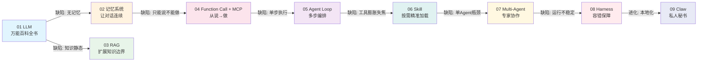
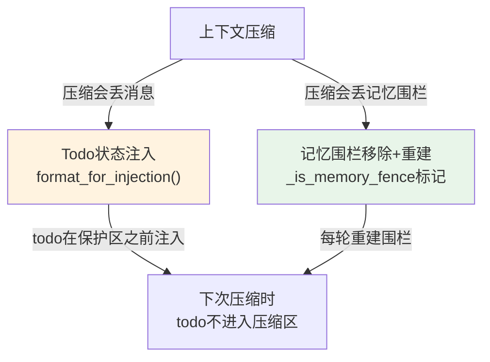
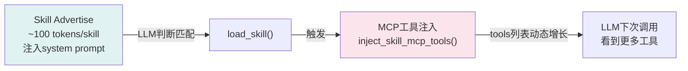
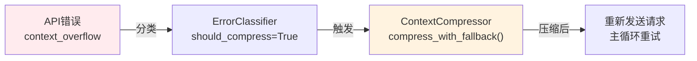
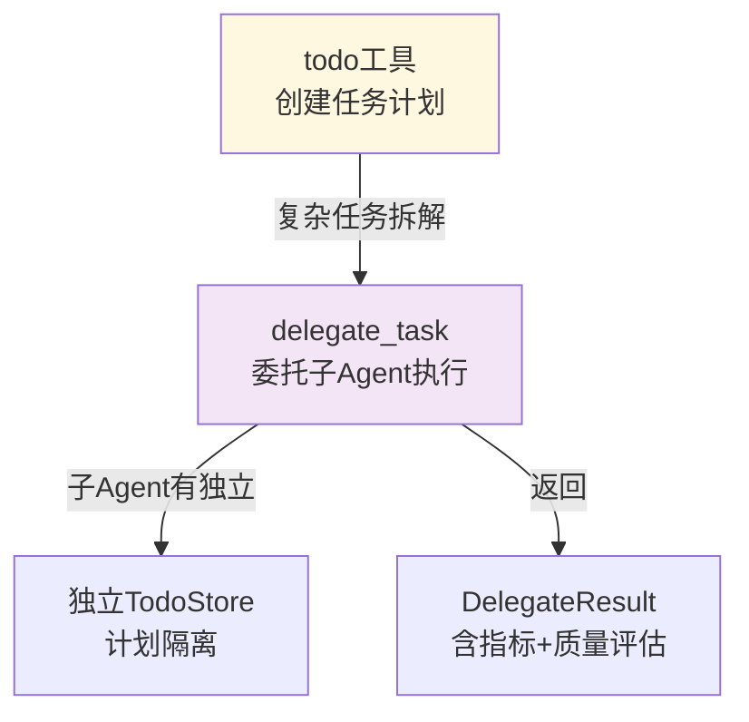
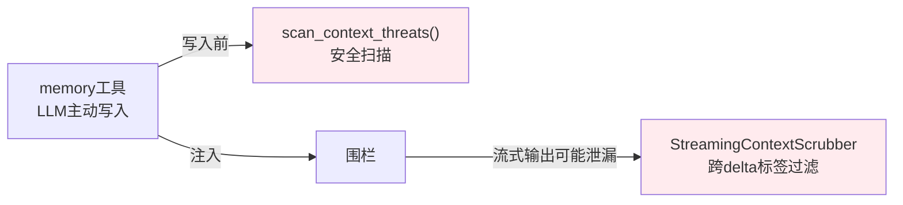
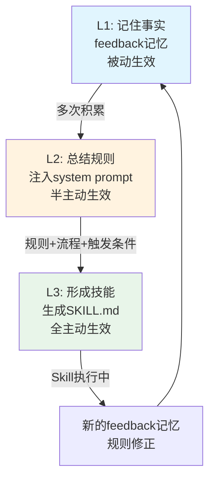
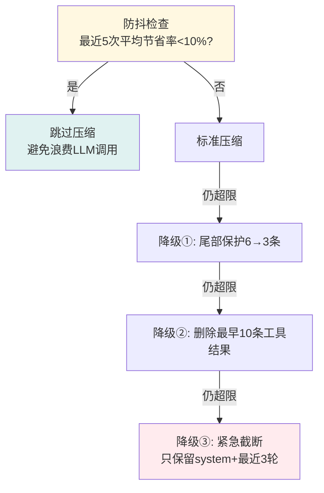

# 从0到1搭建Agent：深层思想脉络与设计哲学

> 基于对 [[从0到1搭建 Agent ：Agent 原理分析及个人助手实践（长文干货）]] 的深度解读，超越代码层面，提炼设计背后的 ==Why== 和 ==跨模块深层联系==。
> 代码梳理详见 [[从0到1搭建Agent-核心代码梳理]]

---

## 一、Agent 技术演化的底层逻辑：问题驱动的链式生长

这篇文章的核心叙事不是"列举技术"，而是 ==**每个技术的出现都是为了解决前一个技术的缺陷**==，形成一条因果链：



> [!important] 三层递进问题
> 文章在结尾揭示，整条技术线本质上在解决三个递进问题：
>
> | 层次 | 问题 | 技术族 |
> |------|------|--------|
> | ==第一层== | **LLM 知道什么** | 知识 → 记忆 + RAG 扩展 |
> | ==第二层== | **LLM 能做什么** | 能力 → Function Call + MCP + Skill |
> | ==第三层== | **LLM 怎么做得好** | 质量 → Agent Loop + Multi-Agent + Harness |
>
> 这三层问题不是一次性解决的，而是 ==**随着实践不断暴露新痛点，再催生新方案**==。

---

## 二、六个反直觉的深层洞察

### 洞察 1：记忆的核心价值不在"存多少"，而在"减少重复表达"

> [!quote] 原文原文
> "记忆系统的核心价值不在于'能存多少'，而在于'能否减少用户的重复表达'。对于个人助手场景，几千字符的有界文件记忆往往比复杂的向量检索系统更实用——==这是一个反直觉但经过验证的结论==。"

==Why==：向量检索系统（如 Mem0）看似强大，但引入了检索噪声、语义匹配不精确等问题。对于个人助手，用户偏好和环境事实是有限的、有结构的——几千字符的 Markdown 文件全量注入反而比向量检索更可靠，因为：
- 全量注入 = ==零检索遗漏==
- 分类清晰 = ==零语义误匹配==
- 有界大小 = ==可控的 token 占用==

### 洞察 2：记忆是被动回忆，技能是主动触发

这是文章最深刻的概念之一。从记忆到技能的转化，本质是从 ==**被动**→**半主动**→**全主动**== 的三级跃迁：

| 层次 | 主动性 | 类比 | 失效模式 |
|------|--------|------|----------|
| **L1: 记住事实** | 被动（检索才生效） | 新员工记笔记 | 语义不匹配→漏检 |
| **L2: 总结规则** | 半主动（每次都生效但只是约束） | 老员工总结经验 | 只有约束没有流程 |
| **L3: 形成技能** | ==全主动==（自动匹配+完整流程+按需工具） | 专家制定SOP | 条件匹配则自动执行 |

==Why this matters==：L1（记忆注入 system prompt）是当前大多数 Agent 的做法，但它是 ==被动== 的——用户问"帮我写测试"时，可能语义检索不到"不要mock数据库"这条记忆。L3（Skill）是 ==主动== 的——一旦匹配到 `integration-testing` skill 的触发条件，整个 SOP 自动执行，不再依赖检索命中率。

### 洞察 3：Plan 不是模式切换，而是普通工具调用

传统 Agent 方案中，ReAct 和 Plan-Execute 是==两套独立的循环逻辑==，需要在两者之间切换模式。本项目的核心创新是：

> ==**Plan 即工具**==——`todo` 是 ReAct 循环中的一个普通 function call，和 `query_weather` 没有本质区别。

==Why this is better==：
- **简单任务零开销**：不需要走 Plan 阶段
- **只有一套循环逻辑**：不需要维护两套 AgentLoop
- **计划随时可调整**：`todo(merge=False)` 一条工具调用就能推翻重来
- **压缩不丢失**：`format_for_injection()` 确保压缩后 todo 状态仍然存在

### 洞察 4：上下文压缩不是简单的"删减"，而是结构化信息重构

很多人以为上下文压缩就是截断历史消息。这篇文章揭示了==三步压缩的真实复杂度==：

| 步骤 | 本质 | 信息损失 |
|------|------|----------|
| Step 1: 保护区划分 | ==选择性保护==（system/首轮/最近3轮不可压缩） | 零（保护区完整保留） |
| Step 2: 工具输出修剪 | ==语义摘要==（不同工具提取不同关键信息） | 低（保留决策关键信息） |
| Step 3: LLM结构化摘要 | ==语义重构==（13字段结构化，区分"重要决策"和"可丢弃试错") | 低（比机械截断密度高得多） |

==核心洞察==：Step 2 的工具输出摘要不是简单截断，而是==针对每种工具提取不同维度的关键信息==——terminal关注命令+退出码，read_file关注路径+偏移量。这让 LLM 在摘要中能回忆"之前做了什么"，而不需要保留几千字的完整输出。

> [!warning] 为什么触发阈值是75%而不是90%
> 因为要给 LLM 回复留空间（completion tokens也占窗口），加上压缩本身也要调用 LLM（也需要 token），所以==必须预留25%余量==。如果在90%才触发，压缩过程本身就可能超出窗口上限。

### 洞察 5：Harness不是可选附件，而是与AgentLoop平级的一等公民

文章引用多个开源项目（DeerFlow 68k stars、SWE-agent 19k stars 等）论证：==没有 Harness 的 Agent 不是不能跑，而是跑不过24小时==。

| Agent组成 | 类比 | 作用 |
|-----------|------|------|
| Agent Loop | 大脑 | 决策逻辑 |
| Harness | ==免疫系统+骨骼+皮肤== | 运行时保护 |

==六重保障的本质==不是"锦上添花"，而是将 LLM 的 ==5-10%工具调用格式错误率== 和 ==更高的幻觉率== 屏蔽掉，让用户感知到的是一个稳定运行的系统。

### 洞察 6：子Agent禁止memory/clarify不是"限制能力"，而是"保障正确性"

| 禁止的工具 | Why |
|-----------|-----|
| `memory` | 多个子Agent并行→==并发写入冲突==。记忆修改应由主Agent统一决策 |
| `clarify` | 子Agent在线程池运行→==无法与用户交互==，阻塞等待用户回复会导致线程池耗尽 |
| `delegate_task`(leaf) | ==防止递归嵌套==，leaf角色只能执行不能再委托 |

==核心原则==：==最小权限==不是限制能力，而是保障正确性。每个子Agent只拥有完成其任务所需的最小权限集。

---

## 三、跨模块深层联系：七个隐藏的设计闭环

这些模块不是孤立存在的，它们之间形成了==7个隐藏的闭环==，每个闭环都是"问题→方案→新问题→新方案"的完整链路：

### 闭环 1：压缩 ↔ Todo ↔ 记忆（防止"失忆"的三重防线）



==Why==：压缩是"有损操作"，但 todo 和记忆是"不能丢失的关键状态"。所以：
- todo：压缩后注入，防止 LLM "忘记做到哪了"
- 记忆围栏：每轮重建（`_is_memory_fence=True`），压缩前移除旧围栏，压缩后重新注入

### 闭环 2：Skill ↔ MCP ↔ 工具注册（按需加载的级联触发）



==Why==：这是一个==级联触发机制==——加载一个 skill 不仅返回操作手册，还触发 MCP 工具注入，让 LLM 的工具列表动态增长。这解决了"工具太多失焦"和"工具太少不够用"的矛盾：
- 平时：只看到 skill 摘要（~100 tokens）
- 需要时：加载 skill + 对应 MCP 工具（~2000 tokens）

### 闭环 3：ErrorClassifier ↔ ContextCompressor（错误驱动的压缩触发）



==Why==：这不是"压缩触发重试"，而是==**错误驱动压缩**==——当 LLM API 返回 `context length exceeded` 时，不是简单重试，而是==先压缩再重试==。这是一个"错误→诊断→治疗→重试"的完整闭环。

### 闭环 4：Todo ↔ SubAgent（计划拆解与任务委托的衔接）



==Why==：todo 和 delegate 是==同一思路的两个层面==——todo 在宏观层面管理"做什么"，delegate 在执行层面管理"谁来做"。子Agent持有独立 TodoStore，确保主Agent的计划和子Agent的计划==互不干扰==。

### 闭环 5：Memory ↔ StreamingScrubber（记忆写入与泄漏防护）



==Why==：记忆系统有==两个安全闭环==：
1. **写入侧**：`scan_context_threats()` 防止恶意内容写入记忆（记忆投毒攻击）
2. **输出侧**：`StreamingContextScrubber` 防止记忆内容通过流式输出泄漏给用户

这是一个 ==Defense in Depth（深层防御）== 的完整实现——写入时扫描，输出时过滤，任何一层失守，另一层仍能拦截。

### 闭环 6：Skill ↔ Memory（从记忆到技能的演化闭环）



==Why==：这不是单向升级，而是==持续演化的闭环==——技能执行中产生新的反馈，反馈再沉淀为规则，规则再升级为技能。Agent 的能力不是一次性构建的，而是 ==**越用越强**== 的渐进演化。

### 闭环 7：压缩防抖 ↔ 渐进式降级（从"温和"到"激进"的弹性策略）



==Why==：防抖和降级是==同一原则的不同体现==——==**渐进式策略**==。防抖防止"过度压缩"（已经压无可压就不要浪费），降级处理"压缩不够"（温和手段不行就逐步激进）。两者共同确保：==**在任何情况下，系统都能找到一条可行的路径**==。

---

## 四、七条设计哲学的深层解读

### 哲学 1：能力层抽象 → Loop 的"极简主义"

> "能力层需要尽可能抽象，对编排层暴露尽可能少的接口"

==深层含义==：AgentLoop 只有 ~30 行核心代码，但背后是 6 个子系统在支撑。这种设计确保：
- Loop 的可读性极高 → ==可维护性==
- 新增保障机制不影响 Loop 结构 → ==可扩展性==
- 任何子系统可独立替换 → ==可替换性==

类比：==操作系统内核极简，但设备驱动层丰富==。Loop 是内核，Harness 是驱动层。

### 哲学 2：分类先于处理 → 精准治理替代粗暴治理

==深层含义==：错误不是"一律重试3次"，而是15+种分类→每种不同策略。这背后是 ==**决策树思维**==：

```
异常 → 分类 → 瞬态(重试) / 限流(等待) / 溢出(压缩) / 永久(终止)
```

如果不分类，重试一个认证错误100次也不会成功。==分类是把不确定性转化为确定性的第一步==。

### 哲学 3：渐进式降级 → 从温和到激进的弹性策略

==深层含义==：无论是压缩降级还是错误恢复，都遵循 ==**从低损失到高损失的渐进路径**==：

| 场景 | 温和策略 | 中等策略 | 激进策略 |
|------|----------|----------|----------|
| 压缩 | 尾部保护6→3 | 删除10条工具结果 | 只保留system+最近3轮 |
| 错误 | 退避重试 | 切换提供商 | 终止+报告用户 |

==Why渐进==：激进策略信息损失大，只在温和策略失败后才启用。这确保 ==**在大多数情况下系统使用最小损失的方案**==。

### 哨学 4：静默优先 → 用户体验优先于系统透明

==深层含义==：能内部恢复的异常不暴露给用户。但 ==静默≠无记录==——所有操作必须可审计（日志/追踪/指标三支柱）。

这是 ==**运维思维与用户体验思维的平衡**==：
- 对用户：静默恢复，体验流畅
- 对运维：完整记录，可追溯诊断

### 哲学 5：预算有限 → 防止"无限优化的陷阱"

==深层含义==：任何自动恢复都有上限。这是 ==**对抗Agent的"静默杀手"**==：

| 杀手类型 | 表现 | 预算机制 |
|----------|------|----------|
| 无限循环 | 不会崩溃但持续消耗 | 迭代预算(90轮) |
| 递归委托 | 子Agent创建子Agent... | 深度限制(1层) |
| 压缩无效 | 反复压缩节省率<10% | 防抖阈值 |
| 子任务挂死 | 永远不返回 | 超时(600秒) |

==核心原则==：==**所有自治行为必须有硬性终止条件**==。没有预算的自治系统不是智能，而是风险。

### 哨学 6：按需加载 → Token效率的10倍提升

==深层含义==：Skill的渐进式加载不是"功能设计"，而是 ==**资源经济学设计**==：

| 方案 | 50工具Token消耗 | 效率 |
|------|-----------------|------|
| 全量注入 | ~50,000 | 1x |
| Skill Advertise | ~5,000 | ==10x== |
| Skill Load后 | +1,000~3,000 | 按需 |

==核心洞察==：==**大多数对话只用1-2个skill**==。全量注入是把50个工具的schema全部塞进prompt，但LLM每次只用到其中1-2个——这是99%的浪费。

### 哨学 7：最小权限 → 安全的不是"能做更多"，而是"不能做不该做的"

==深层含义==：子Agent的权限隔离不是限制能力，而是 ==**通过禁止错误操作来保障正确性**==：

- `memory` 禁止 → 防止并发写入冲突
- `clarify` 禁止 → 防止线程池阻塞
- `delegate_task`(leaf)禁止 → 防止递归嵌套

类比：==银行柜员不能访问金库==，不是因为柜员能力不足，而是因为职责不同。最小权限让每个Agent ==只在自己的职责范围内运作==，减少跨域干扰。

---

## 五、从理论到实践的映射：技术如何落地

文章的理论篇和实践篇不是割裂的，而是==一一对应的映射关系==：

| 理论概念 | 实践落地 | 具体模块 |
|----------|----------|----------|
| 短期记忆(messages数组) | 上下文压缩 | `ContextCompressor` |
| 长期记忆(跨会话) | MEMORY.md + USER.md | `FileMemoryProvider` |
| 记忆→技能(L3) | SKILL.md自动生成 | `SkillsLoader` + `SkillService` |
| RAG(Agentic RAG) | Skill中的references按需读取 | `read_skill_resource()` |
| Function Calling | 工具注册+分发+修复 | `ToolRegistry` + `ToolDispatcher` |
| MCP协议 | MCP工具按需注入 | `McpService` + `inject_skill_mcp_tools()` |
| ReAct范式 | AgentLoop while循环 | `loop.py` |
| Plan-Execute混合 | todo工具嵌入ReAct | `TodoStore` + `todo_tool.py` |
| Multi-Agent(主从委托) | delegate_task + SubAgent | `delegate.py` + `IdleAgent` |
| Harness六子系统 | 六重保障 | `IterationBudget/ErrorClassifier/ContextCompressor/StreamingContextScrubber/ToolDispatcher/TodoStore` |

> [!tip] 关键发现
> ==理论篇的每一个概念都在实践篇有对应的代码实现==。这不是巧合，而是说明这个项目的架构是 ==**从理论问题驱动出来的**==，而非从代码框架倒推出来的。

---

## 六、文章揭示的三个未解之问

文章坦诚承认了Agent领域尚未解决的三个核心问题：

### 问1：记忆到技能的自动转化何时触发？

> "同一主题 ≥ N 条记忆 → 触发技能生成"

但 ==N 的阈值是多少==？太低→过度生成无用skill；太高→错过有价值的技能沉淀时机。文章只给出了两种路径（Agent主动提议 vs 系统自动聚类），但没有给出具体的阈值策略。

### 问2：Multi-Agent的任务拆解粒度？

> "拆太细增加通信开销，拆太粗失去并行意义"

文章给出"3-5个子任务为宜"的经验值，但 ==LLM拆解的准确性本身就不稳定==——同样的任务，不同时间拆解的结果可能完全不同。这是一个 ==LLM决策质量问题==，目前没有完全可靠的解决方案。

### 问3：Agent没有划时代的范式

> "实际 agent 没有跑出一个很划时代的范式，大家还在探索阶段"

这意味着当前的架构（ReAct+Skill+Multi-Agent+Harness）是 ==**当前最优实践**==，但不是终极形态。文章的两个建议值得深思：
1. ==**观测比开发更重要**==——Agent是概率系统，持续监控和打磨是常态
2. ==**保持对前沿方案的敏感度**==——半年一个代际，好架构思路比堆人力有效10倍

---

## 关联知识

- [[从0到1搭建Agent-核心代码梳理]] — 代码层面的详细梳理
- [[记忆系统]] — 记忆的三层架构与L1→L2→L3演化
- [[ReAct 范式]] — ReAct循环与Plan-as-Tool创新
- [[Skill 渐进式加载]] — 四阶段加载与MCP联动
- [[Harness 容错框架]] — 六重保障与七大设计原则
- [[Multi-Agent 协作模式]] — 七种模式对比与本项目组合策略