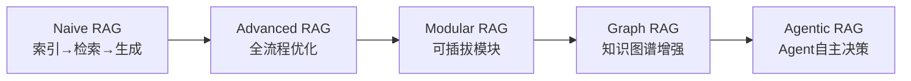
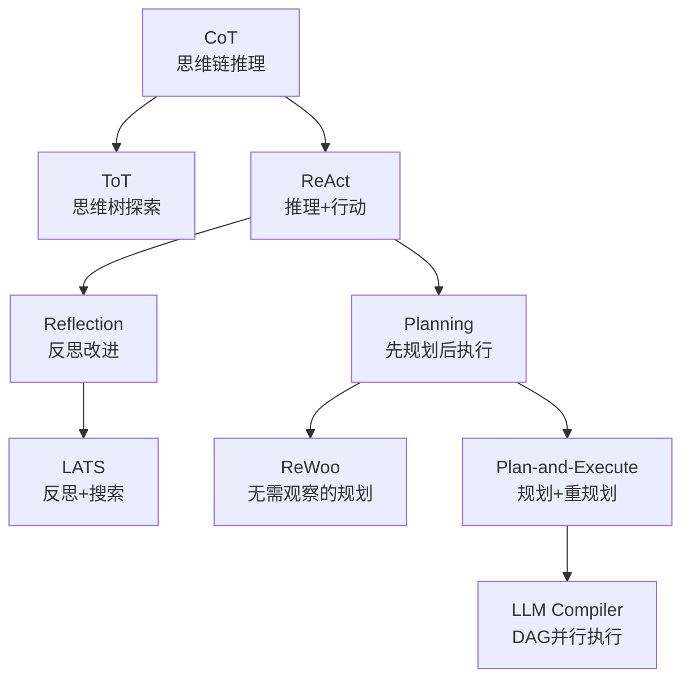
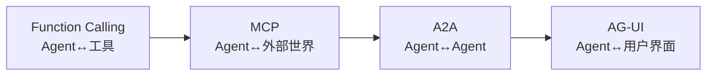
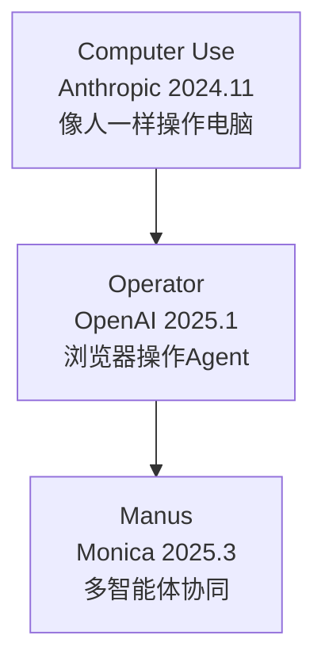

# RAG·MCP·Agent爆发之旅——深度整理

> 原文追踪大模型应用从"能用"到"好用"再到"自主执行"的完整演进路径：==RAG解决知识问题== → ==Agent解决行动问题== → ==通信协议解决协作问题== → ==模型即产品解决范式问题==。四个层次层层递进，共同构成大模型应用的爆发之旅。

---

## 一、大语言模型发展脉络

| 时间 | 标志事件 | 核心突破 |
|------|----------|----------|
| 2017 | [[Transformer 架构]] | 自注意力机制替代RNN/LSTM，重新定义NLP |
| 2018 | BERT / GPT | 双向理解（BERT）与自回归生成（GPT），预训练范式确立 |
| 2020 | GPT-3（1750亿参数） | 少样本/零样本学习，超大规模模型潜力验证 |
| 2021-2022 | SFT + RLHF | 对齐人类价值观，缓解幻觉（"一本正经胡说八道"） |
| 2022 | GPT-3.5 → ChatGPT | ==ChatGPT时刻==：对话式AI改变人机交互 |
| 2023-2024 | GPT-4V/4o 多模态 | 文本+图像+音频+视频统一系统 |
| 2023-2024 | LLaMA3.1-405B | 开源首次缩小与闭源差距 |
| 2024.9 | OpenAI o1-preview | ==推理模型==诞生：从系统1（快/直觉）到系统2（慢/分析），[[CoT]] 长链思维 |
| 2024.12 | DeepSeek-V3 → DeepSeek-R1 | 高性价比推理模型，MoE架构+GRPO训练，开源破圈 |
| 2025.1 | OpenAI o3/o4-mini | 图像融入思维链，工具调用内置，比o1减少20%重大错误 |

> [!important] 核心转折
> 2022年ChatGPT时刻是大模型应用的起点，但落地时暴露三大瓶颈：==知识局限性==（实时/私域数据盲区）、==幻觉问题==（过度自信胡说八道）、==数据安全性==（企业私域数据保护）。这三大瓶颈直接催生了RAG和Agent的需求。

---

## 二、RAG演进路线——从被动检索到主动决策

### 演进总览



### 各阶段详解

#### Naive RAG（2020）

[[RAG]]的原始形态，确立"==索引→检索→生成=="三阶段流程：

- **索引**：文档切分 → Embedding → 存入向量数据库
- **检索**：查询向量化 → 相似度计算 → Top-K块召回
- **生成**：Query + Chunks → Prompt拼接 → LLM生成回复

问题：==语义鸿沟==（模糊查询检索失效）+ ==信息冗余==（重复/无关结果）

#### Advanced RAG（2022后）

针对Naive RAG的局限，提出==全流程优化==：

| 优化方向 | 关键技术 |
|----------|----------|
| 预索引优化 | 多粒度分块、元数据嵌入、混合索引（BM25+向量）、假设性问题、HyDE |
| 后索引优化 | ReRank重排序、Prompt压缩 |
| Embedding优化 | Fine-tuning Embedding（领域适配）、Dynamic Embedding（上下文自适应） |
| 查询转换 | 子查询拆解、多轮对话补齐、LLM驱动的查询改写 |

> [!tip] HyDE逆向逻辑
> HyDE让LLM为查询生成一个"假设性回答"，再用这个假设回答的向量来检索——因为假设回答比原始查询与真实文档的语义相似度更高。

#### Modular RAG

将线性流程拆分为==独立可插拔模块==（检索器、预处理器、生成器等），像"乐高积木"自由组合：

- **动态流程编排**：路由+调度+知识图谱融合，实现多路径检索与智能决策
- **混合检索**：稀疏检索（BM25）+ 密集检索（向量模型）+ 外部API/数据库工具

#### GraphRAG

引入[[知识图谱]]概念，构建实体关系网络：

- **优势**：节点连接性（推理实体关系）、层次知识管理、上下文丰富（基于图的路径）
- **局限**：可扩展性有限（依赖图结构）、数据依赖（高质量图数据）、集成复杂性
- **适用场景**：==医疗诊断、法律研究==等需要结构化关系推理的领域

#### Agentic RAG

在RAG基础上引入[[智能体（Agent）]]，核心突破：

| 传统RAG | Agentic RAG |
|---------|-------------|
| 单一知识源 | ==多源聚合==（向量搜索+Web API+计算器+内部数据库） |
| 单次检索→生成 | ==迭代推理+验证==（反馈循环，非单次通过） |
| 固定流程 | ==自主决策==（Agent动态路由查询和数据） |
| 单Agent | ==多代理架构==（路由Agent分配给专门检索Agent，主Agent汇总） |

> [!important] 范式跃迁
> Agentic RAG从"==静态查找=="思维转向"==自适应问题解决=="思维——Agent利用推理能力处理新问题类型或数据源，不受开发者预期场景的限制。

---

## 三、Agent设计模式演进——从推理到行动到反思到规划

### 演进总览



### 各模式详解

#### [[CoT]]——思维链（2022.5）

谷歌论文，在Prompt中加入推理步骤示例，引导模型分步思考。

- **贡献**：首次证明大模型可通过==显式推理链==提升复杂任务性能；提出"推理即生成"新范式
- **局限**：==只有一条路径==，无法回溯或探索替代方案

#### [[ToT]]——思维树（2023）

CoT的拓展，将一条reasoning路径拓展为==多条reasoning paths==，综合多路径结果得出结论。

- **贡献**：从线性到==树状推理==的跃迁；引入状态评估器+搜索算法自主评估推理路径价值；建立可解释性新标准
- **核心**：每个节点代表中间状态，分支生成+动态评估+前瞻探索+回溯修正

#### [[ReAct 范式]]——推理与行动（2022.10）

将推理（Reasoning）与行动（Acting）结合，形成"==思考→行动→观察=="循环。

- **贡献**：协同推理与行动的新范式；突破静态问答，推动AI从==静态问答→动态决策==
- **局限**：成本高昂（多次LLM调用）、耗时长、已有思考无法固化、可能陷入死循环

#### Reflection——反思改进

让模型==自我批判性思考==并改进输出：

| 模式 | 机制 |
|------|------|
| Basic Reflection | Generator生成 + Reflector审查，左右互搏多轮优化 |
| Reflexion | 在Basic基础上引入强化学习：Actor执行→Evaluator评分→Self-Reflection生成文本反馈→存入记忆指导后续决策 |

> [!note] Reflexion的核心创新
> 将传统RL的参数更新机制转化为==语言形式反馈信号==——不仅接收"失败"信号，还获得具体错误原因的文本反馈。利用长短期记忆存储反思经验。

#### [[LATS]]——语言Agent树搜索

结合reflection + 蒙特卡洛树搜索（MCTS），4步循环：

1. **选择**：根据累计奖励选最佳下一步
2. **展开+模拟**：并行生成N个行动方案
3. **反思+评估**：基于反思和外部反馈对决策打分
4. **反向传播**：更新根路径分数

> [!important] LATS的统一意义
> LATS将Reflexion、ToT、Plan-and-Execute等架构的==推理、规划、反思组件统一==，是一个集大成者。

#### Planning——规划模式

| 模式 | 核心 | 与ReAct区别 |
|------|------|------------|
| [[ReWoo]] | Planner→Worker→Solver，生成一次性完整工具链 | 减少token消耗和执行时间；规划数据不依赖工具输出，可独立微调 |
| [[Plan-and-Execute]] | Planner→Executor→Replanner | ==加入了Replan机制==，根据执行反馈动态调整计划 |
| [[LLM Compiler]] | Planner输出DAG+Task Fetching Unit调度+Joiner决策 | ReWOO的进化版，==DAG明确依赖关系→并行执行→类似处理器乱序执行== |

---

## 四、通信协议三层定位——Agent如何连接世界

### 协议演进



> [!important] 三层定位
> Agent生态中有三个核心角色：==用户==、==Agent==、==外部世界==。四个协议分别面向不同角色之间的连接。

| 协议 | 连接对象 | 核心定位 |
|------|----------|----------|
| Function Calling | Agent↔工具 | LLM识别需要什么工具并格式化调用 |
| [[MCP]] | Agent↔外部世界 | 通用协议框架发现、定义、调用外部工具能力 |
| [[A2A]] | Agent↔Agent | 跨平台安全标准化协作 |
| [[AG-UI]] | Agent↔用户界面 | 标准化Agent与前端应用的交互 |

### Function Calling局限

- 缺乏统一标准（各平台机制不同）
- 上下文不统一（各模型对工具行为解释不同）
- 扩展复杂度高（工具多/有依赖时需中间调度逻辑）

### MCP突破

[[MCP]]通过==高度标准化==解决Function Calling的碎片化问题，Host-Client-Server架构实现：

- MCP Host：宿主环境（Claude桌面端、IDE）
- MCP Client：客户端SDK
- MCP Server：功能/数据接口提供者
- 数据源/远程服务：Server后端

### A2A四大功能

- **Capability discovery**：Agent Card（JSON）宣传能力
- **Task management**：Task对象有生命周期，支持长时任务同步
- **Collaboration**：认证/授权保障身份互信
- **UX negotiation**：协商内容格式和用户界面呈现方式

### AG-UI关键特性

- 实时事件流（用户与AI状态同步）
- 人机协作（用户介入AI决策）
- 传输灵活（SSE/WebSocket）
- 轻量设计（最小化依赖）
- 标准化事件类型

---

## 五、通用Agent产品——从被动响应到主动执行

### 演进路径



| 产品 | 核心能力 | 关键创新 |
|------|----------|----------|
| [[Computer Use]] | 截屏→理解→移动光标/点击/输入 | ==从API软件能力到Action操作系统==，范式重构 |
| [[Operator]] | CUA模型驱动，视觉+RL推理+模仿鼠标操作 | 感知→推理→行动三段框架，无需自定义API |
| [[Manus]] | 多Agent协同+虚拟机沙盒+长短期记忆 | ==从对话交互到人机协作==，思考-规划-执行闭环交付成果 |

> [!important] Manus的产品形态创新
> Manus的核心贡献不在底层模型突破，而在==工程化编排能力==——动态调度多模型资源（Claude/DeepSeek等），集成RL算法+工具包生态。类比：不是发明新引擎，而是造出了一辆能自动驾驶的车。

---

## 六、模型即产品——下一代Agent范式

### 三大趋势驱动范式转变

1. **Scaling Law失效**：GPT-4.5证明，通用模型能力线性增长但算力指数飙升
2. **定向训练超预期**：RL+推理让小模型在特定任务上变强（数学、编程、甚至玩宝可梦）
3. **推理成本极速下降**：DeepSeek优化后全球GPU可支撑每人每天1万token调用，卖token模式不再成立

### 基础模型→推理模型→模型化Agent

| 阶段 | 代表 | 特点 |
|------|------|------|
| 基础模型 | GPT-3/4 | 预训练Scaling Law驱动，通用能力 |
| 推理模型 | o1/o3, DeepSeek-R1 | ==慢思考==，长链CoT，RL训练推理能力 |
| 模型化Agent | [[DeepResearch]] | ==端到端==，模型内部完成搜索，无需外部调用 |

### DeepResearch——模型即产品的典范

OpenAI ==从零训练==了一个全新模型（不是在o3外面套壳）：

- 模型自主掌握网页浏览能力（搜索、点击、滚动、理解文件）
- 无需外部调用、提示词或人工流程干预
- 是==研究型语言模型==（Research Language Model），不是普通聊天机器人
- 生成报告篇幅更长、结构严谨、信息分析过程清晰

### 强化学习+推理训练Agent

| 技术 | 说明 |
|------|------|
| RL训练 | Agent在"文本迷宫"中寻找出路，verifier验证目标达成 |
| 草稿模式 | 生成草稿+同时评估，强化学习只关注结果有效性，允许非正统捷径 |
| 结构化输出 | "评分标准工程"，便于奖励验证 |
| 多步训练 | 大量草稿+多步骤迭代，DeepSeek GRPO+vllm成为首选方法 |

> [!quote] Alexander Doria & Shunyu Yao
> "The Model is the Product"——端到端Agent，模型即产品。这是下一代Agent范式。

---

## 七、构建Agent的核心原则

三家权威指南共识：

> [!abstract] 三项核心原则
> 1. **保持简洁性**：设计尽量简单，避免不必要复杂化
> 2. **注重透明性**：清晰展示规划步骤，建立用户信任
> 3. **评估体系构建**：建立量化指标驱动持续优化

| 原则 | 说明 |
|------|------|
| 简单优先 | 优先找最简方案，仅在必要时增加复杂度；有时根本无需构建Agent系统 |
| 权衡考量 | Agent系统以==延迟和成本==换取任务性能，需谨慎权衡 |
| 工作流vs Agent | 工作流适合==明确、可预测==场景；Agent适合==灵活、模型驱动决策==场景 |
| 框架慎用 | 框架增加抽象层→调试困难→诱导过度复杂；建议先用LLM API直写 |
| 单Agent优先 | 先最大化==单一Agent==能力；更多Agent增加复杂性和开销，通常一个带工具的Agent就够 |

### 多Agent拆分信号

当Agent出现以下问题时考虑拆分：
- 无法遵循复杂指令
- 持续选择错误工具
- 需要专业化分工

拆分方式：按领域、按工具集、按职责分离

---

## 八、核心洞察总结

### 1. 四层递进逻辑

```
知识层（RAG） → 行动层（Agent） → 协作层（通信协议） → 范式层（模型即产品）
```

每一层解决上一层暴露的新问题：RAG解决模型的知识盲区→Agent让模型能行动→但Agent需要连接外部世界和彼此→最终发现最好的Agent就是模型本身。

### 2. 从"外挂"到"内生"

RAG是模型的外挂知识库→Function Calling是外挂工具→MCP是标准化外挂接口→但==推理模型+RL训练==让这些能力逐渐==内化到模型本身==。DeepResearch就是这个方向的里程碑。

### 3. 多Agent失败的根源

[[多智能体协作]]的三类失败：==规范问题==（地基没打好）、==沟通问题==（信息不流通）、==验证问题==（质检形同虚设）。改进方向：明确终止条件、标准化通信协议、强化验证机制、低置信度时暂停。

### 4. Scaling Law失效后的新增长曲线

预训练Scaling Law遇到瓶颈后，增长曲线转向==RL+推理==。这不是替代，而是补充——用"慢思考"弥补"快直觉"的不足，用定向训练弥补通用能力的边界。

---

## 关联知识

- [[RAG]] — 从Naive RAG到Agentic RAG的五阶段演进
- [[MCP]] — Agent与外部世界的标准化连接协议
- [[A2A]] — Agent间协作的标准化协议
- [[AG-UI]] — Agent与用户界面的交互协议
- [[智能体（Agent）]] — Agent的定义、核心组件
- [[ReAct 范式]] — 推理+行动的基础范式
- [[CoT]] — 思维链推理
- [[ToT]] — 思维树探索
- [[Reflection 范式]] — 反思改进机制
- [[LATS]] — 语言Agent树搜索
- [[ReWoo]] — 无需观察的规划
- [[Plan-and-Execute]] — 规划+重规划
- [[LLM Compiler]] — DAG并行执行
- [[Computer Use]] — Anthropic的计算机操作Agent
- [[Operator]] — OpenAI的浏览器操作Agent
- [[Manus]] — Monica的多智能体协同Agent
- [[DeepResearch]] — OpenAI的端到端研究型模型
- [[智能体发展史]] — 从符号逻辑到LLM-Based的演进
- [[多智能体协作]] — 多Agent协作架构与挑战
- [[智能体通信协议]] — MCP/A2A/ANP/Function Calling对比

## 参考资料

- [[万字详解大模型应用发展：RAG、MCP、Agent的爆发之旅]] — 原文资源